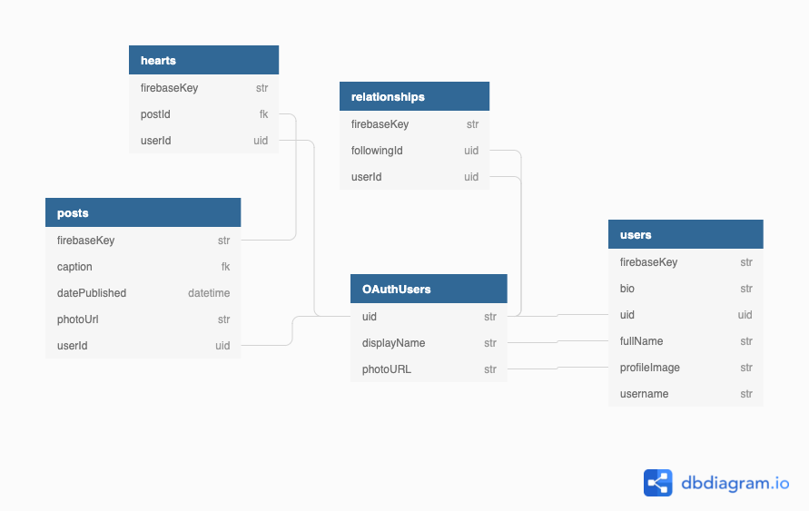

# Rules

# Feature List
- General
  - Each user should have a user object in FB.
  - When getting the current date use the `getCurrentDate` function in `/helpers/dateHelper.js`.
  - Get username from characters before @ in user's email address
  - Don't use the Firebase key from the user node when referencing a user, always use the uid from the auth user.
  - Do not update the components file. You may update the styles bot do not update the React code it's self.
- Login Page
  - At route path: `/login`
  - Shows up if user's not logged in
  - User can login to app using google auth
- Feed Page
  - At route path: `/`
  - Components Used:
    - Use `PostDetailCard` component to show a single post
  - A feed with all posts posted in the app
  - Stretch: Only show own posts and posts of people you follow
- Browse Page
  - At route path: `/browse`
  - Components Used:
    - Use the `UserList` component to show the user list
  - A list of all the users on the app
  - The ability to search through the users by name and username
- Create Post
  - At route path: `/create`
  - Has a form to create a post. (Look at ERD for data structure)
  - Stretch: Use Firebase cloud storage to allow image upload.
- Edit Post
  - At route path: `/edit/{{ postId }}`
  - Has a prepopulated form to update a post. (Look at ERD for data structure)
  - Stretch: If postId in url is to a post that does not belong to the current user or does not exist, redirect them to the home page.
- Heart Page `/hearts`
  - At route path: `/hearts`
  - Components Used:
    - Use `PostDetailCard` component to show a single post
  - Shows all the posts a user has hearted.
- Profile View
  - At route path: `/sham/{{ username }}`
  - Components Used:
    - Use `PostGrid` component to show preview of all the user's posts
    - Use `ProfileInfo` component to show user information
  - View how many posts user has
  - View how many followers user has
  - View how many people user follows
  - View user's image, bio, and full name
  - View preview of all post user has
  - If not current user, allow user to follow or unfollow a user
  - If current user have a button that allows them to go to a settings page.
- Post Details Page
  - At route path: `/posts/{{ postId }}`
  - Components Used:
    - Use `PostDetailCard` component to show a single post
  - Shows a post based on the id in the url
- Settings page
  - Allow user to update their bio
  - Allow user to logout

## ERD

